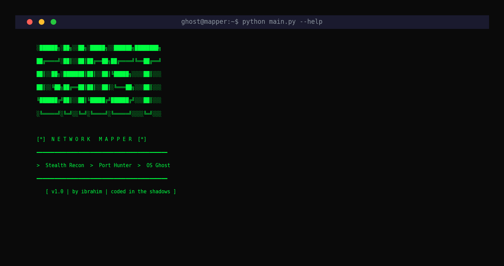
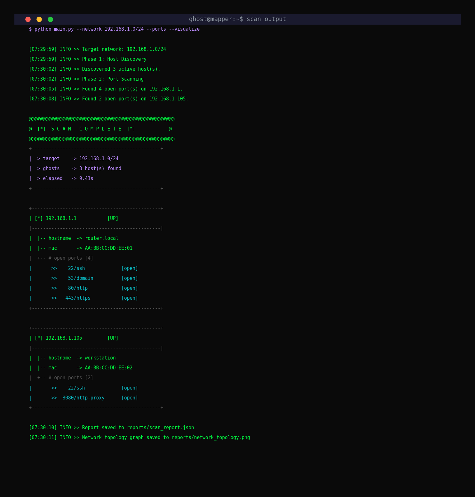
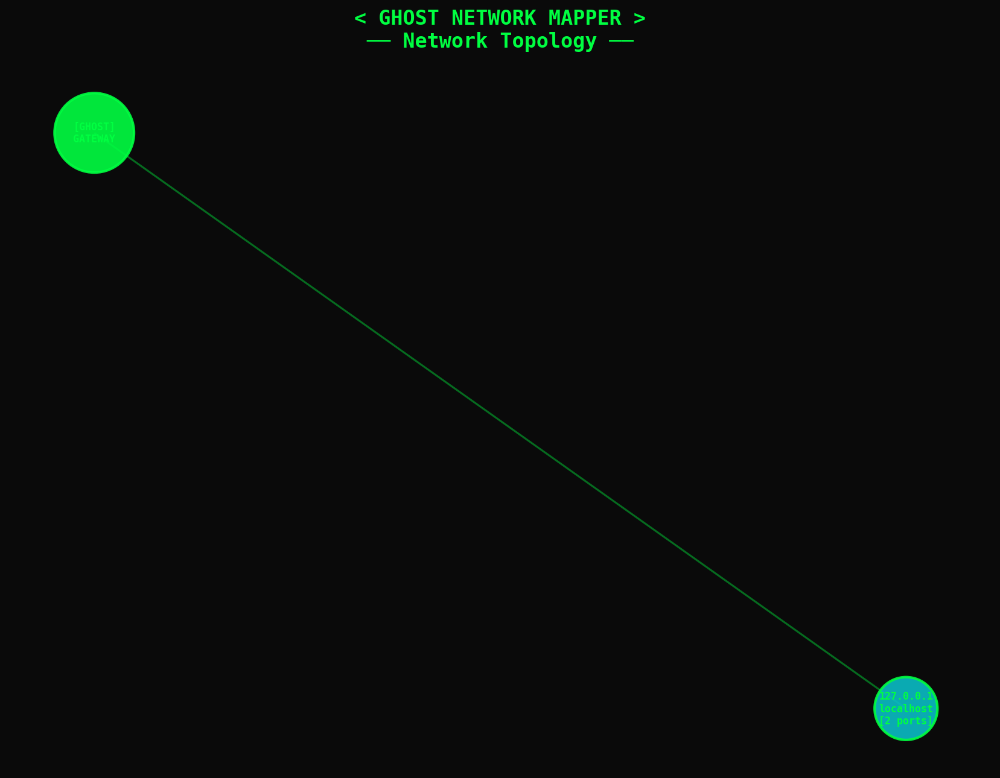

# 👻 Ghost Network Mapper

A cybersecurity tool that scans local networks using Nmap to discover active devices, identify open ports, detect operating systems, and visualize network topology.

> *Coded in the shadows by **ibrahim***

---

## 📸 Screenshots

### Banner


### Scan Results


### Network Topology Graph


---

## ⚡ Features

- **Host Discovery** — Find all active devices on a network range
- **Port Scanning** — Identify open ports and running services
- **OS Detection** — Fingerprint operating systems on discovered hosts
- **Device Info** — Extract IP, hostname, MAC address, and vendor
- **JSON Reports** — Timestamped scan reports saved automatically
- **Network Visualization** — Dark-themed topology graph using NetworkX & Matplotlib
- **Hacker UI** — Styled CLI output with ASCII art banner and color-coded results

---

## 🛠 Installation

### Prerequisites

- Python 3.8+
- Nmap installed on your system

### Setup

```bash
# Clone the repository
git clone https://github.com/Ibrahim-dad/ghost-network-mapper.git
cd ghost-network-mapper

# Install Python dependencies
pip install -r requirements.txt

# Verify Nmap is installed
nmap --version
```

---

## 🚀 Usage

```bash
# Basic host discovery
python main.py --network 192.168.1.0/24

# Host discovery + port scanning
python main.py --network 192.168.1.0/24 --ports

# Host discovery + port scanning + OS detection
python main.py --network 192.168.1.0/24 --ports --os

# Full scan with network topology visualization
python main.py --network 192.168.1.0/24 --ports --os --visualize

# Custom port range
python main.py --network 192.168.1.0/24 --ports --port-range 1-65535

# Scan a single host
python main.py --network 192.168.1.1/32 --ports --visualize
```

### CLI Options

| Flag | Description |
|------|-------------|
| `--network`, `-n` | Target network in CIDR notation (required) |
| `--ports`, `-p` | Enable port scanning |
| `--os` | Enable OS detection (may require root) |
| `--visualize`, `-v` | Generate network topology graph |
| `--port-range` | Custom port range (default: 1-1024) |

---

## 📁 Project Structure

```
ghost-network-mapper/
├── scanner/
│   ├── network_scan.py    # Host discovery using Nmap ping scan
│   └── port_scan.py       # Port scanning and OS detection
├── visualizer/
│   └── graph.py           # Network topology graph generation
├── reports/               # Generated JSON reports & topology images
├── screenshots/           # README screenshots
├── utils/
│   └── logger.py          # Centralized logging configuration
├── main.py                # CLI entry point
├── requirements.txt       # Python dependencies
└── README.md
```

---

## 📄 Sample JSON Report

```json
{
    "scan_info": {
        "network": "192.168.1.0/24",
        "timestamp": "2026-03-08T07:29:59.123456",
        "duration_seconds": 9.41,
        "port_scan_enabled": true,
        "os_detection_enabled": false,
        "port_range": "1-1024"
    },
    "hosts": [
        {
            "ip": "192.168.1.1",
            "hostname": "router.local",
            "state": "up",
            "mac": "AA:BB:CC:DD:EE:01",
            "vendor": "Cisco",
            "ports": [
                {"port": 22, "state": "open", "service": "ssh"},
                {"port": 80, "state": "open", "service": "http"}
            ]
        }
    ]
}
```

---

## ⚠️ Notes

- **Port scanning** automatically falls back from SYN scan to TCP connect scan when root privileges are unavailable
- **OS detection** requires root/sudo privileges and will gracefully skip if not available
- **Reports** are saved to the `reports/` directory with timestamps
- **Use responsibly** — only scan networks you own or have permission to scan

---

## 📦 Dependencies

- [python-nmap](https://pypi.org/project/python-nmap/) — Nmap wrapper for Python
- [networkx](https://pypi.org/project/networkx/) — Network graph library
- [matplotlib](https://pypi.org/project/matplotlib/) — Graph visualization

---

## 📜 License

This project is open source and available for educational and authorized security testing purposes.

---

*👻 Ghost Network Mapper — by ibrahim*
